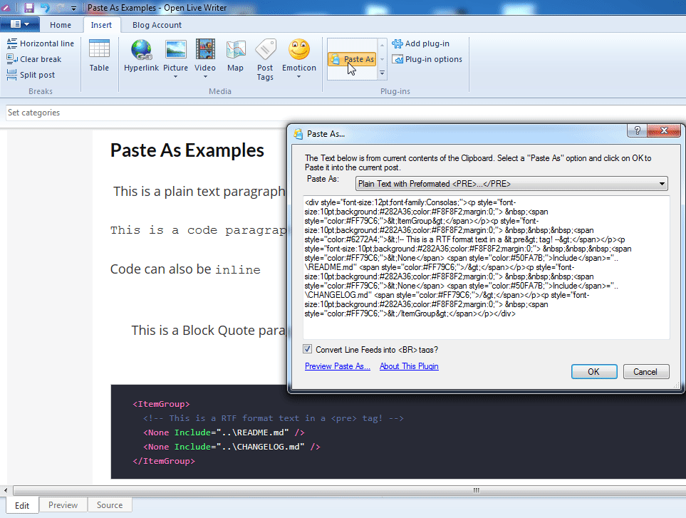
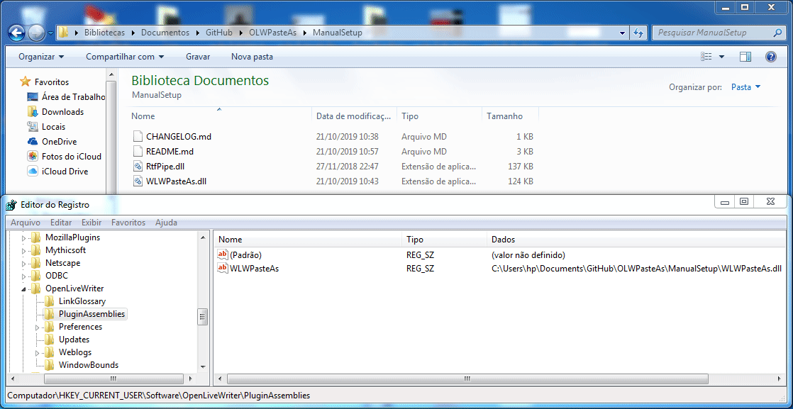

# Paste As Plugin for Open Live Writer

> Welcome to the Paste As project. The Paste As Plugin makes pasting text or raw HTML easier and simpler. Copy the HTML to the clipboard, click on "Insert Paste As", click Ok. That's it, two clicks and the HTML is inserted into your post as formatted HTML (i.e. you get the image/bitmap/picture and not the HTML tags...).

Fork from [WLW Paste As](https://coolthingoftheday.blogspot.com/2006/09/wlw-paste-as-10-plugin-preview.html) to allow "Paste As Plain Text..." Or "Paste As HTML..." into Open Live Writer.

Here are some preview screenshots:



# v1.0.1.2 Released

The [Changelog](CHANGELOG.md) has a few more details and information.

# Installation Instructions

1. Download [Paste As Plugin](https://github.com/coldscientist/OLWPasteAs/releases/latest).
2. Close/exit Open Live Writer if it is running.
3. By default OLW will look in the Plugins folder inside the application path (e.g: `C:\Users\UserName\AppData\Local\OpenLiveWriter\app-0.5.1.3\Plugins`) but this path will change as OLW auto-updates itself (i.e. the app number will change). To install copy the plugin to that path using the latest `…\app-x.x.x.x` folder present on your system. Each time OLW updates to a new version you will need to re-copy or move the plugin into the new `…\app-x.x.x.x` folder.
4. Alternatively use this approach: OLW (like WLW before it) checks the registry for plugins too and so you can add a registry key telling OLW where to find the plugin. Whilst this feature is supported by OLW this should enable the plugin to survive OLW auto updates without you having to do anything. Just download and extract the plugin to a folder on your harddrive and then add a new registry key to `HKEY_CURRENT_USER\SOFTWARE\OpenLiveWriter\PluginAssemblies` with the name (can be anything) and the location of the plugin. For example: 
4. Start Open Live Writer.
5. That's it!

# RTF format

[Notepad++](http://notepad-plus.sourceforge.net/uk/site.htm) has a plugin called "[NppExport]((https://stackoverflow.com/questions/3475790/copy-notepad-text-with-formatting))" (comes pre-installed) that allows you to copy to RTF, HTML and ALL:

1. Select the Text
1. From the menu, go to Plugins > NPPExport (comes pre-installed) > Copy RTF to clipboard
1. A shortcut is to use: [Settings > Shortcut Mapper > Plugin Commands > Copy all Formats to clipboard] and set it to CTRL+SHIFT+C. CTRL+C to copy the raw text, CTRL+SHIFT+C to copy with formatting.

It is worth mentioning that **64-bit Notepad++ does not support Plugin Manager and NPPExport**.

# Compilling

Compilling the code with Visual Studio or MSBuild will produce a DLL called `WLWPasteAs.dll`.

1. You'll need to edit `WLWPasteAs\WLWPasteAs.vbproj` file and change `OpenLiveWriter.Api` Reference directory with your Open Live Writer installation directory.
1. You can compile the code through Visual Studio or through MSBuild (doesn't require Visual Studio) typing the following command at **Command prompt**:

```
C:\Windows\Microsoft.NET\Framework\v4.0.30319\msbuild.exe "C:\Users\hp\Documents\GitHub\OLWPasteAs\WLWPasteAs.sln"
```

If you receive a message `This assembly is built by a runtime newer than the currently loaded runtime and cannot be loaded.` (OpenLiveWriter.Api.dll), try
compilling it with .NET 3.5 first:

```
C:\Windows\Microsoft.NET\Framework\v3.5\msbuild.exe "C:\Users\hp\Documents\GitHub\OLWPasteAs\WLWPasteAs.sln"
```

You may need [Microsoft Windows SDK for Windows 7 (7.1)](https://github.com/coldscientist/OLWInlineCode#compilling) to build this project.
